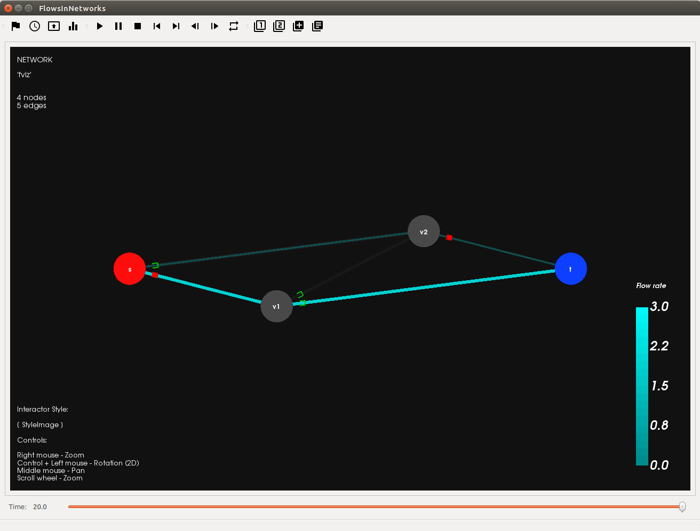
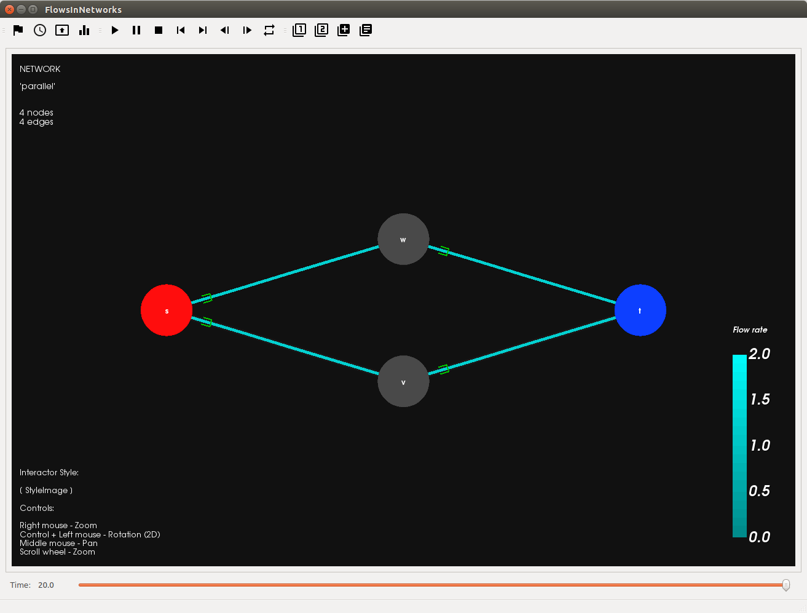
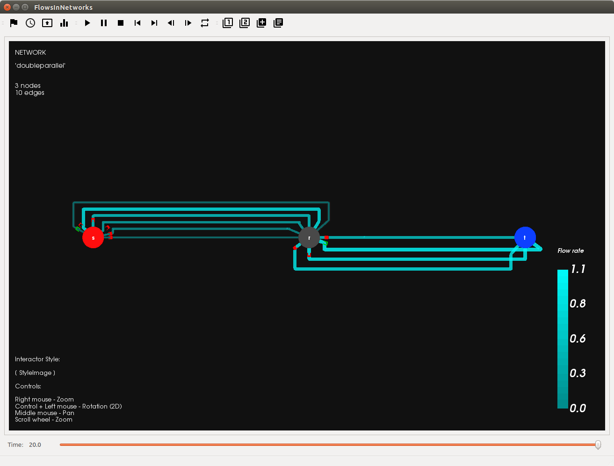
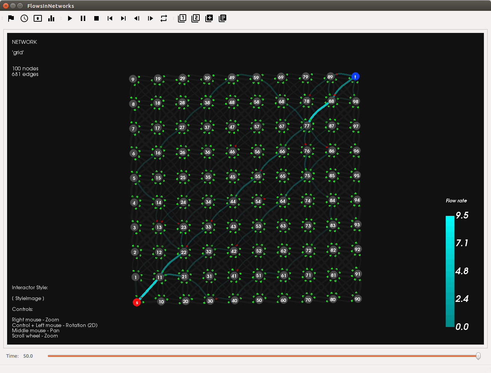
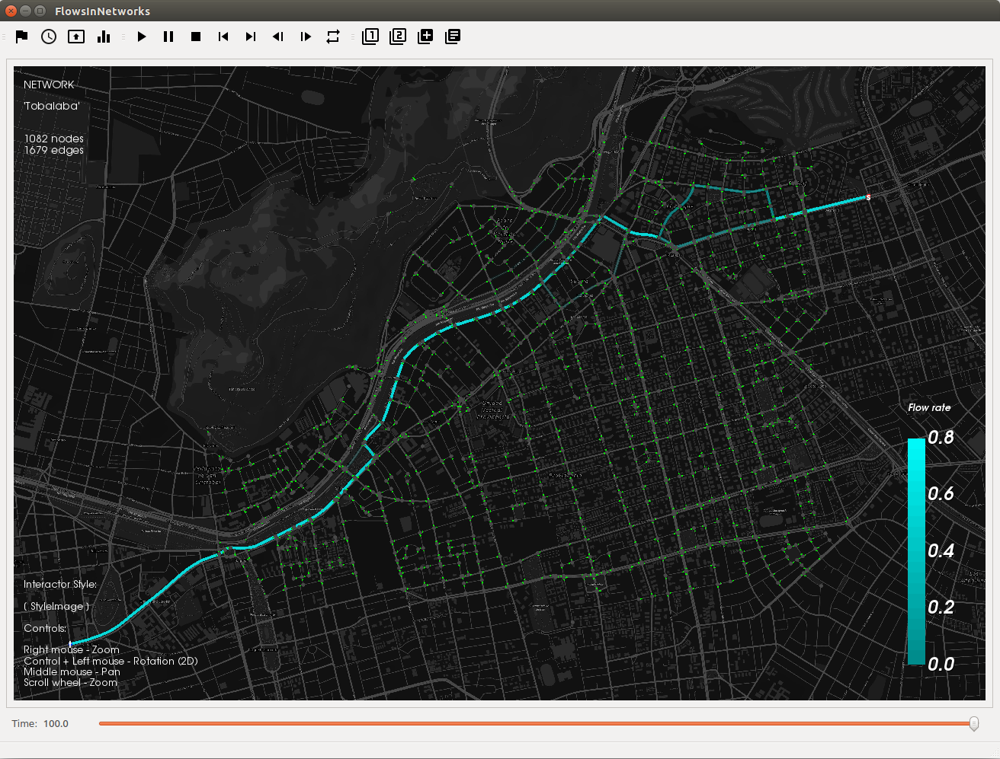

Examples
===================

In this section are presented the settings and required files (if proceed) for the following project examples:

- fviz
- parallel
- doubleparallel
- grid
- Tobalaba (road network example)

Note: You will be able to see a larger screenshot for each example, after make click on the respective image.

|

Example 1: *fviz*
------------------

Screenshot
^^^^^^^^^^

|exa1|

Settings
^^^^^^^^^^^^^

.. code-block :: python

  # Simulation parameters
  TIME_OF_EVENT = [0.0,50.0]
  INPUT_FLOW = [4.0]

  # Sampler and layout parameters
  TIME_STEP = 0.1
  CUSTOM_LAYOUT = 0

  # GUI visualizer parameters
  T_MAX_VIS = 20.0
  FPS = 24

.. code-block :: python

  def network_graph_data():

      G=nx.MultiDiGraph()
      G.add_node('s')
      G.add_node('v1')
      G.add_node('v2')
      G.add_node('t')

      G.add_edge('s','v1',time=1.,capacity=3.)
      G.add_edge('s','v2',time=3.,capacity=4.)
      G.add_edge('v1','v2',time=1.,capacity=2.)
      G.add_edge('v1','t',time=14/3.0,capacity=3.)
      G.add_edge('v2','t',time=1.,capacity=1.)

      source = 's'
      sink = 't'

      return [G, source, sink]

Example 2: *parallel*
----------------------

Screenshot
^^^^^^^^^^

|exa2|

Settings
^^^^^^^^^^^^^

.. code-block :: python

  NETWORK_NAME = "parallel"
  TYPE = "network"

  # Simulation parameters
  TIME_OF_EVENT = [0.0,50.0]
  INPUT_FLOW = [4.0]

  # Sampler and layout parameters
  TIME_STEP = 0.1
  CUSTOM_LAYOUT = 0

  # GUI visualizer parameters
  T_MAX_VIS = 20.0
  FPS = 24

.. code-block :: python

  def network_graph_data():

      G=nx.MultiDiGraph()
      G.add_nodes_from("svwt")

      G.add_edge('s','v',time= 1., capacity=10.)
      G.add_edge('s','w',time= 2., capacity=2.)
      G.add_edge('v','t',time= 2., capacity=10.)
      G.add_edge('w','t',time= 1., capacity=2.)

      source = 's'
      sink = 't'

      return [G, source, sink]

Example 3: *doubleparallel*
----------------------------

Screenshot
^^^^^^^^^^

|exa3|

Settings
^^^^^^^^^^^^^

.. code-block :: python

  NETWORK_NAME = "doubleparallel"
  TYPE = "network"

  # Simulation parameters
  TIME_OF_EVENT = [0.0,50.0]
  INPUT_FLOW = [4.0]

  # Sampler and layout parameters
  TIME_STEP = 0.1
  CUSTOM_LAYOUT = 1

  # GUI visualizer parameters
  T_MAX_VIS = 20.0
  FPS = 24

.. code-block :: python

    def network_graph_data():

        G=nx.MultiDiGraph()
        G.add_nodes_from("srt")

        G.add_edge('s','r',time= 1./2.0, capacity=0.5)
        G.add_edge('s','r',time= 1., capacity=0.6)
        G.add_edge('s','r',time= 3./2.0, capacity=0.7)
        G.add_edge('s','r',time= 2., capacity=0.8)
        G.add_edge('s','r',time= 5./2.0, capacity=0.9)
        G.add_edge('s','r',time= 3., capacity=1.0)
        G.add_edge('r','t',time= 1., capacity=0.8)
        G.add_edge('r','t',time= 2., capacity=0.9)
        G.add_edge('r','t',time= 3., capacity=1.)
        G.add_edge('r','t',time= 4., capacity=1.1)

        source = 's'
        sink = 't'

        return [G, source, sink]

.. code-block :: python

  def network_custom_layout (G):

      # Databuilder import

      import databuilder.layouts.utils.gviz as gviz_layouts

      # [ Set graphviz layout parameters ]
      graphviz_prog = 'dot'
      graphviz_args = '-Granksep=2.0 -Grankdir=LR -Gsplines=ortho -Nfixedsize=true -Nheight=0.05'

      #[ Create file with layout information ]

      gviz_file_path = os.path.join(project_dir_path, 'rsc', 'gviz', ''.join((NETWORK_NAME,'_custom.txt')))

      A = nx.to_agraph(G)
      A.draw(gviz_file_path, format='plain', prog=graphviz_prog, args=graphviz_args)

      # Generate graph image with graphviz (optional)
      # A.draw(gviz_file_path.replace('.','')+'.png', format='png', prog=graphviz_prog, args=graphviz_args)

      # [ Load the file with the layout information ]
      gviz_file_path = os.path.abspath(os.path.join(project_dir_path, 'rsc', 'gviz',''.join((NETWORK_NAME, '_custom.txt'))))
      gviz_layouts.addGeometryFromGVizFile(G, gviz_file_path, splines_degree=4, number_of_points=50) # important!

      return None

Example 4: *grid*
------------------

Screenshot
^^^^^^^^^^

|exa4|

Settings
^^^^^^^^^^^^^

.. code-block :: python

  NETWORK_NAME = "grid"
  TYPE = "network"

  # Simulation parameters
  TIME_OF_EVENT = [0.0,100.0]
  INPUT_FLOW = [10.0]

  # Sampler and layout parameters
  TIME_STEP = 0.1
  CUSTOM_LAYOUT = 1

  # GUI visualizer parameters
  T_MAX_VIS = 50.0
  FPS = 24

.. code-block :: python

  def network_graph_data():

      import random

      G = nx.MultiDiGraph()

      # Set parameter to define the number of nodes
      # * number of nodes = N*N

      N = 10

      # nodes
      for i in xrange(N*N):

          G.add_node(i)

      # edges
      for i in xrange(N):

          for j in xrange(N):

              k = i*N + j
              time = 0.1 + random.random()
              capacity = 0.1 + 10*random.random()

              if (i != N-1 and j != N-1):

                  G.add_edge(k,k+1, time = time, capacity = capacity)
                  G.add_edge(k,k+N, time = time, capacity = capacity)
                  G.add_edge(k,k+N+1, time = time, capacity = capacity)
                  G.add_edge(k+1,k+N, time = time, capacity = capacity)

                  G.add_edge(k+1,k, time = time, capacity = capacity)
                  G.add_edge(k+N,k, time = time, capacity = capacity)
                  G.add_edge(k+N+1,k, time = time, capacity = capacity)
                  G.add_edge(k+N,k+1, time = time, capacity = capacity)

              if (i == N-1 and j != N-1):

                  G.add_edge(k,k+1, time = time, capacity = capacity)
                  G.add_edge(k+1,k, time = time, capacity = capacity)

              if (i != N-1 and j == N-1):

                  G.add_edge(k,k+N, time = time, capacity = capacity)
                  G.add_edge(k+N,k, time = time, capacity = capacity)

      source = G.nodes()[0]
      sink = G.nodes()[-1]

      return [G, source, sink]

.. code-block :: python

  def network_custom_layout (G):

      # Databuilder import

      import databuilder.layouts.utils.gviz as gviz_layouts

      # [ Set graphviz layout parameters ]
      graphviz_prog = 'neato'
      graphviz_args = '-Granksep=0.05'

      #[ Create file with layout information ]

      gviz_file_path = os.path.join(project_dir_path, 'rsc', 'gviz', ''.join((NETWORK_NAME,'_custom.txt')))

      A = nx.to_agraph(G)
      A.draw(gviz_file_path, format='plain', prog=graphviz_prog, args=graphviz_args)

      # Generate graph image with graphviz (optional)
      # A.draw(gviz_file_path.replace('.','')+'.png', format='png', prog=graphviz_prog, args=graphviz_args)

      # [ Load the file with the layout information ]
      gviz_file_path = os.path.abspath(os.path.join(project_dir_path, 'rsc', 'gviz',''.join((NETWORK_NAME, '_custom.txt'))))
      gviz_layouts.addGeometryFromGVizFile(G, gviz_file_path, splines_degree=3, number_of_points=50) # important!

      return None

Example 5: *Tobalaba*
----------------------

Required files
^^^^^^^^^^^^^^

To be able to run this example is necessary to use the files 'bounds.py', 'map.jpeg' and 'tobalaba.osm'
available in the compressed file tobalaba.zip :download:`[download] <files/tobalaba.zip>`.

The following locations must be verified for this files:

- myprojects/Tobalaba/map/bound.py
- myprojects/Tobalaba/map/map.jpeg
- myprojects/Tobalaba/osm/tobalaba.osm

Screenshot
^^^^^^^^^^
|exa5|

Settings
^^^^^^^^^^^^^

.. code-block :: python

  NETWORK_NAME = "Tobalaba"
  TYPE = "network"

  # Simulation parameters
  TIME_OF_EVENT = [0.0,500.0]
  INPUT_FLOW = [500.0]

  # Sampler and layout parameters
  TIME_STEP = 0.5
  CUSTOM_LAYOUT = 1

  # GUI visualizer parameters
  T_MAX_VIS = 100.0
  FPS = 24

.. code-block :: python

  def network_graph_data():

      import databuilder.layouts.utils.osm as osm

      osm_file_path = os.path.abspath(os.path.join(NETWORK_NAME,'rsc','osm','tobalaba.osm'))

      nw = osm.OsmNetwork(osm_file_path)

      G, source, sink = nw.get_network_graph_data()

      return [G, source, sink]

.. code-block :: python

  def network_custom_layout (G):

      import databuilder.layouts.utils.osm as osm

      osm.reset_osm_geometry(G)

      return None
