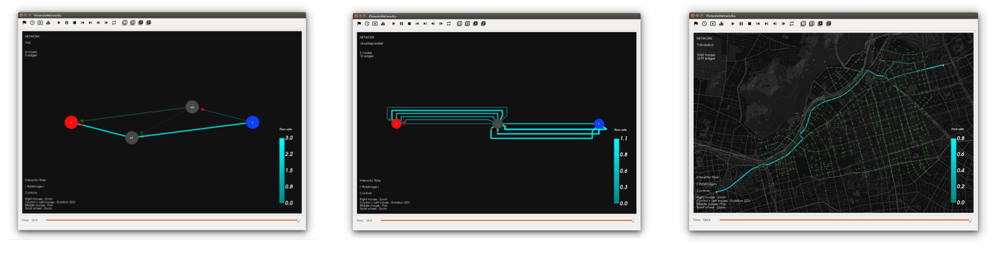

.. network_viz documentation master file, created by
   sphinx-quickstart on Mon Oct 26 18:08:21 2015.
   You can adapt this file completely to your liking, but it should at least
   contain the root `toctree` directive.

Welcome
========

The goal of this project is to design and develop software
prototypes for the simulation and the visualization of dynamic flows in networks.

The software **network_viz** is a first software prototype developed for the visualization of
dynamic equilibria from time varying flows.

A start guide and general documentation to use this software are available in this website.

|
|

|
|

Project Members
---------------

**Project Admin**:

* Vincent Acary  <vincent.acary@inria.fr>

**Members**:

* Jean-Nicolas Roussel
* Roberto Cominetti
* Maximiliano Olivares <maximiliano.olivares@inria.cl>

|

Contents
========

.. toctree::
  :maxdepth: 3

  overview
  installing
  tutorial
  examples
  dev

|

|

* :ref:`genindex`
* :ref:`modindex`
* :ref:`search`

|
