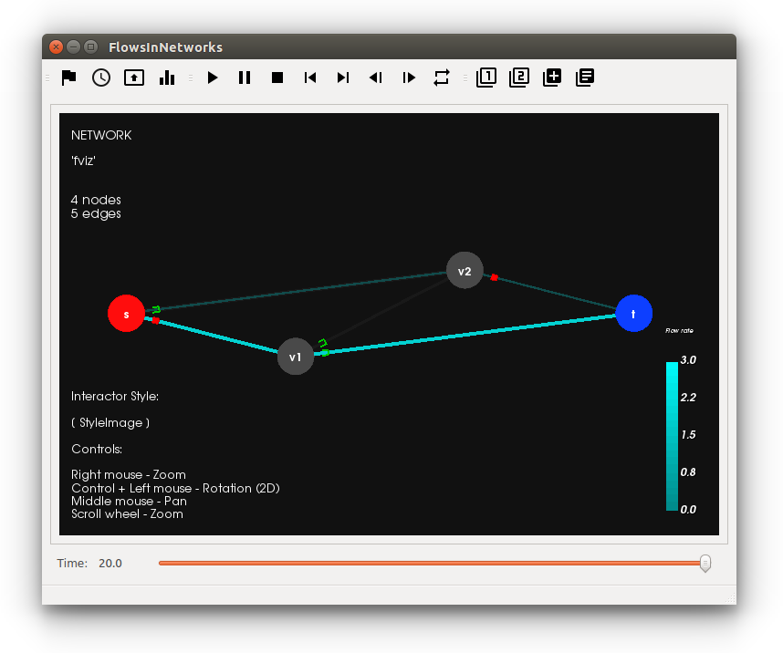

Overview
===========================

Currently, the simulation and visualization of time varying flows in networks developed in this project is based on the
*fluid queue model* [1]_. This model is stated in terms of flow rates on every edge, considering a continuous
stream of particles injected at a source *s* which travels
towards a sink *t* through edges, characterized by a *latency* and a *per-time-unit* capacity.

The time to traverse
an edge is composed of a flow-dependent waiting time in a queue at the entrance of the edge, plus a constant travel
time after leaving the queue. Considering a dynamic network routing game perspective, in this model each infinitesimal
particle is interpreted as a *player* that seeks to complete its journey in the **least possible time**.

|

.. [1] Roberto Cominetti, José Correa, Omar Larré (2015). Dynamic Equilibria in Fluid Queueing Networks. Operations Research 63(1):21-34.

|

   Example of the visualization of flows over time with the software prototype *network_viz*.

About network_viz
-----------------
|

- Software prototype developed in *Inria Chile*.

  http://www.inria.cl

|

- Contact:

  Vincent Acary  <vincent.acary@inria.fr>

|

- Icons from "Material design icons" by Google.

  Material-design-icon github website:

  https://github.com/google/material-design-icons
