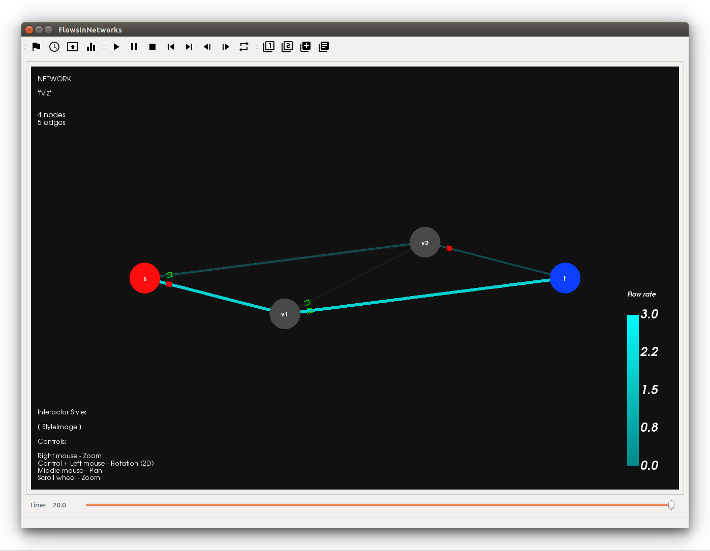
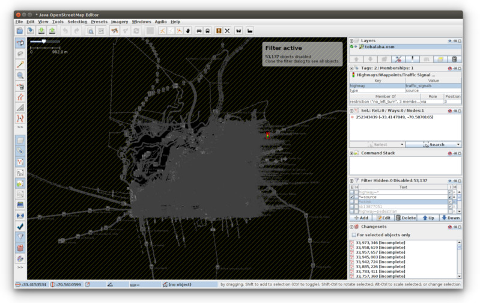
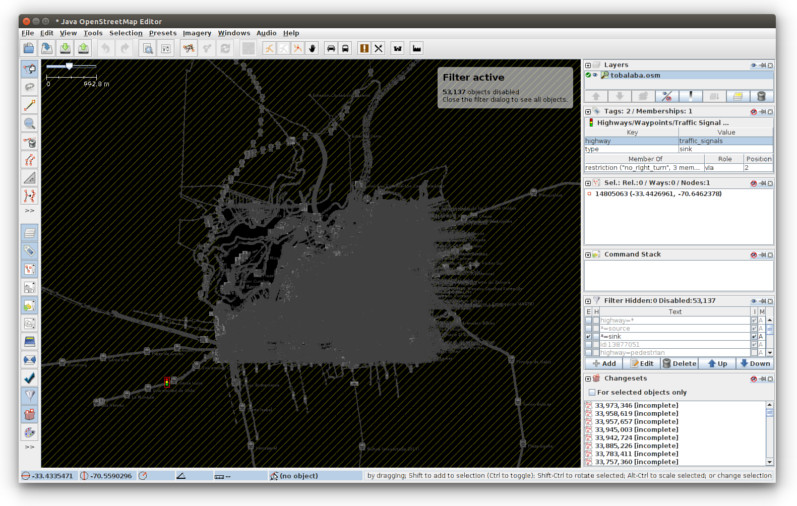

Tutorial
===============

Fundamentals
---------------------------------

The network_viz software works in terms of visualization projects which
are stored in a workspace folder created by the user.

To create and execute a new visualization project is necessary to follow, at least,
the following steps:

- Creation of a visualization workspace.
- Creation of a new visualization.
- Edition of the network visualization settings.
- Update of the visualization project.
- Run the network visualization.

Creating the visualization workspace
^^^^^^^^^^^^^^^^^^^^^^^^^^^^^^^^^^^^^

Before create a network visualization, it is necessary create a workspace folder
which will contains the set of projects defined by the user. This can be done directly
using the instruction::

~$ mkdir myprojects

The network_viz.py script must be used inside this folder, for instance::

~/myprojects$ network_vis.py -h

Start a new project
^^^^^^^^^^^^^^^^^^^^^^^^^^^^

After create the workspace, a new project can be created using
the network_viz.py script with the option --new with the project name as the respective argument ::

~/myprojects$ network_viz.py --new PROJECT_NAME

This option will create a new folder inside the workspace, called as the respective project name with
a set of folders and files which will contains the information required to run the network visualization,
according to the following description

.. glossary::

  settings.py
    Main file of the visualization project. The user must define in this file the information for the network
    to be studied among some related parameters for the visualization.

  /data
    Folder to store generated data for the network visualization.

  /rsc
    Resources folder for the network visualization. This folder contains, by default, the subfolders: /gviz,
    to store data about the network layout; /map, to store images to be used as background (optional) and /osm, to store
    osm files employed to the generation of networks from OpenStreetMap's data. More subfolder can be added by the user.

Visualization settings
^^^^^^^^^^^^^^^^^^^^^^^^^^^^
Once the visualization project is created is necessary to edit the associated network visualization settings in the file *settings.py*.
There are two general components to be edited by the user: the network visualization *parameters* and *functions*.

Visualization settings: Parameters
"""""""""""""""""""""""""""""""""""
In this file there will be considered the following types for the network visualization parameters:

**Simulation parameters**

- TIME_OF_EVENT (list): List with required dimension >= 2. The ith and (i+1)th component of this list corresponds to the lower and upper bound for a time interval associated to a source node inflow value equals to the ith component of the INPUT_FLOW list.
- INPUT_FLOW (list): List with required dimension equals to the number of TIME_OF_EVENT components minus 1. The ith component of this list, corresponds to the source node inflow value in the time interval with lower bound equals to the ith component of TIME_OF_EVENT and upper bound equals to the (i+1)th of the TIME_OF_EVENT list.

**Sampler and layout parameters**

- TIME_STEP (float): Time step to be used by the databuilder application to generate discretized data for the network visualization from simulation results.
- CUSTOM_LAYOUT (int): Parameter with value 0 or 1. If its value is equal to 1 the application will use the 'network_custom_layout' function to build spatial data for the network visualization. If its value is equal to 0, this function is not considered in the visualization project.

**GUI visualizer parameters**

- T_MAX_VIS (float): Time horizon for the visualization.
- FPS (int): User expected frames per second.

Visualization settings: Functions
"""""""""""""""""""""""""""""""""""
On the other hand, in the settings.py file will be available the following functions:

.. glossary::

  network_graph_data()
    Function which must contain the definition of the network to be studied as a networkx's graph. This function has no arguments and must return the graph G, the source node and the sink node of the network.

  network_custom_layout(G)
    Function which must contain instructions to create spatial data for the network's layout (to be considered only if CUSTOM_LAYOUT==1). This function has a networkx graph has argument with no variables to return.

Once the network visualization parameters and functions are defined, is necessary to *update* the project, process which will create the data to be visualized.

The project update process
^^^^^^^^^^^^^^^^^^^^^^^^^^^^

A project can be updated using::

~/myprojects$ network_vis.py --update PROJECT_NAME

With the option *--update* the network_viz.py script will execute a list of programs which
will create the data to be visualized according to the following stages:

1. **Simulation**

  The program will run a simulation for the development of the flow over time on the network
  creating data in terms of piecewise functions, which must be sampled to generate discrete
  data to be visualized.

2. **Simulation data sampling**

  The simulation data created in the previous stage is *sampled* according to the TIME_STEP
  value defined in the visualization settings.

3. **Network layout**

  Using the visualization settings, the program uses a set of functions to create
  geometry and topology data for the nodes and edges of the studied network.
  If non particular information is used to set the network layout,
  the software employs the Python interface to the Graphviz_
  graph layout and visualization package to generate a basic
  layout data. Another option corresponds to the use of OpenStreetMap files
  (with extension .osm) to use the spatial data of street / road networks.
  Then, the basic layout information is processed to consider a set of divisions
  for each edge, according to the time step defined for the network visualization
  which lets to display what will be the flow particles position at each time.

.. _Graphviz: http://www.graphviz.org

This three process are executed under the use of the option *--update*, which corresponds to
a *full update* for the project.
However, under small changes on the visualization parameters, some of the stages of a full update
for the project could take several minutes to be completed
(for instance, the simulation process for a large network).
For this case, currently there are available two additional options
*--update-sample* and *--update-layout* according to particular changes
on the parameters and functions of the visualization settings which are
commented in the following resume for the update options.

.. glossary::

  network_viz.py --update PROJECT_NAME
    Full update for the visualization project (simulation, simulation data sampling, network layout data generation).

  network_viz.py --update-sample PROJECT_NAME
    Partial update which
    executes the *simulation data sampling* and *network layout* processes.
    Requires a previous full update for the project.
    This option can be used under changes on the TIME_STEP value.

  network_viz.py --update-layout PROJECT_NAME
    Partial update which
    executes the *network layout* process.
    Requires a previous full update for the project.
    This option can be used under changes on the CUSTOM_LAYOUT visualization
    parameter and / or the network_custom_layout function (applied only if
    CUSTOM_LAYOUT==0).

Run a network visualization
^^^^^^^^^^^^^^^^^^^^^^^^^^^^^

After create the required data files using the update option, you will be
able to run the visualization with the option start of the network_viz.py script::

~/myprojects$ network_viz.py --start PROJECT_NAME

A first visualization project
-----------------------------

In this section will be ilustrated the use of the
script network_viz.py for a first standard project "fviz".

**Creating the visualization workspace**

Create a new folder for the project.

::

  ~$ mkdir myprojects

**Start the new project "fviz"**

Create the main files for the project using the *--new* option of the network_viz.py script, inside the workspace folder.

::

  ~$ cd myprojects

  ~/myprojects$ network_viz.py --new fviz

After the execution of this instruction the file *settings.py* will be available inside a new folder
called as the visualization project *fviz*, which must be edited to set the visualization parameters.

**Visualization settings**

Edit the file *settings.py*

::

  ~/myprojects$ nano ./fviz/settings.py

and add the following definitions for the associated parameters and functions:

.. code-block :: python

  # Simulation parameters
  TIME_OF_EVENT = [0.0,50.0]
  INPUT_FLOW = [4.0]

  # Sampler and layout parameters
  TIME_STEP = 0.1
  CUSTOM_LAYOUT = 0

  # GUI visualizer parameters
  T_MAX_VIS = 20.0
  FPS = 24

.. code-block :: python

  def network_graph_data():

    G=nx.MultiDiGraph()
    G.add_node('s')
    G.add_node('v1')
    G.add_node('v2')
    G.add_node('t')

    G.add_edge('s','v1',time=1.,capacity=3.)
    G.add_edge('s','v2',time=3.,capacity=4.)
    G.add_edge('v1','v2',time=1.,capacity=2.)
    G.add_edge('v1','t',time=14/3.0,capacity=3.)
    G.add_edge('v2','t',time=1.,capacity=1.)

    source = 's'
    sink = 't'

    return [G, source, sink]

Considering that we set the CUSTOM_LAYOUT parameter equals to 0, is not necessary to edit the
network_custom_layout function.

**Project update**

From the workspace folder, update the project to generate the visualization data.

.. code-block:: bash

  ~/myprojects$ network_viz.py --update Larre

**Run the visualization**

Finally, run the visualization using

.. code-block:: bash

  ~/myprojects$ network_viz.py --start Larre

|

  GUI with the fviz project visualization.

Using graphviz to modify the network layout
--------------------------------------------

The default definition for the *network_custom_layout* function in *settings.py*
can be used to modify the network layout using spatial data created with graphviz
and used as reference, after set some related parameters.

.. code-block:: python

  def network_custom_layout (G):

    # Important!: This method is applied only if CUSTOM_LAYOUT = 1

    # Example:

    # Databuilder import

    import databuilder.layouts.utils.gviz as gviz_layouts

    # [ Set graphviz layout parameters ]
    graphviz_prog = 'dot'
    graphviz_args = '-Gnodesep=1.0 -Grankdir=LR -Gsplines=ortho'

    #[ Create file with layout information ]

    gviz_file_path = os.path.join(project_dir_path, 'rsc', 'gviz', ''.join((NETWORK_NAME,'_custom.txt')))

    A = nx.to_agraph(G)
    A.draw(gviz_file_path, format='plain', prog=graphviz_prog, args=graphviz_args)

    # Generate graph image with graphviz (optional)
    # A.draw(gviz_file_path.replace('.','')+'.png', format='png', prog=graphviz_prog, args=graphviz_args)

    # [ Load the file with the layout information ]
    gviz_file_path = os.path.abspath(os.path.join(project_dir_path, 'rsc', 'gviz',''.join((NETWORK_NAME, '_custom.txt'))))
    gviz_layouts.addGeometryFromGVizFile(G, gviz_file_path, splines_degree=3, number_of_points=50) # important!

    return None

In this case, you can modify the network layout after set the string variables
*graph_viz_prog* and *graph_viz_args* which must contain the associated instructions for the
graphviz_ library . It is possible to consider the following values:

.. _graphviz: http://www.graphviz.org

.. glossary::

  graphviz_prog
    String which can take one of the following values:
    **'dot'** (for hierarchical or layered drawing of directed graph),
    **'neato'** (spring model layout),
    **'fdp'** (sprin model similar to neato),
    **'sfdp'** (multiscale version of fdp),
    **'twopi'** (radial layouts) or
    **'circo'** (circular layout). For large graph is recommended the use of the 'sfdp' option.

  graphviz_args
    String which contains a set of values for node, edge and graph attributes
    according to the information available in graphviz_attrs_.

    To illustrate how to use this variable we will review the attribute *splines*,
    which controls how and if, edges are represented. This attribute can take, among others,
    the values:*line* and *spline*  (as synonyms of false and true), *polyline* (to specify that
    edges should be drawn as polylines), *ortho* (to specify that edges should be route as
    polylines of axis-aligned segments) or *curved* (to specify that edges should be drawn as
    curved arcs). The *splines* attribute is used by the root graph, represented by the character *G*.
    Then, to use the value ortho for the spline attribute is necessary to add the instruction
    '-Gsplines=ortho' in the graphviz_arg variable. More options can be added using a space
    between the instructions.

    Some other useful attributes are *nodesep* (in dot, the minimum space between two adjacent
    nodes in the same rank in inches) and *overlap* (which determines if and how node overlaps
    should be removed). An example of how this attributes can be considered in the graphviz_args
    variable is in the form of the string '-Gnodesep=1.0 -Goverlap=prism'.

.. _graphviz_attrs: http://www.graphviz.org/doc/info/attrs.html

After set the CUSTOM_LAYOUT parameter equals to 1, and update the project, you will be able to
obtain a new layout for the newtork visualization.

  New layout for the network of the fviz project.

A street network
------------------

[Work in progress]

Another type of network which could be studied with this software corresponds to street networks,
using OpenStreepMaps files (with extension .osm) as a source.

Currently the time and capacity for this type of network is established as a random value.

To create a visualization of this type, is necessary to have:

- An edited osm file, with two node with the extra attribute *type* with the associated values *source* and *sink* (to be explained in this section).
- A map image (jpeg file) to be used as background (optional), with its respective crop bounds.

.. figure:: tobalaba_josm.jpeg
  :scale: 90%
  :alt: fviz project - new layout
  :align: center
  :figwidth: 800px

GUI available options
----------------------
